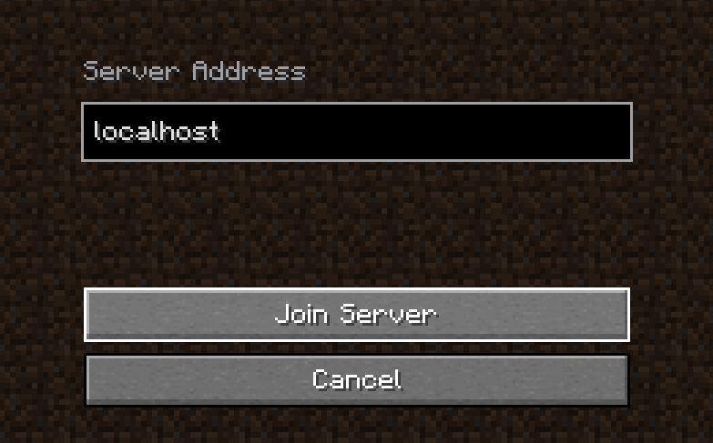
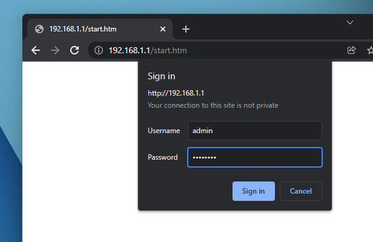

# Create your own Minecraft Java Edition server from home
In this guide, I'll run through all the steps needed to get your very own Minecraft Java Edition server up and running, and all you'll need is your computer. After we finish the initial setup, I'll recommend some plugins that'll help you get the most out of your server.

Let's get started!

## Disclaimers
* Be sure you know what operating system you're running (typically Windows or macOS), as some things may vary between these systems. When that's the case, there will be instructions for each operating system.
* All of the software listed below is free. You shouldn't need to pay anything to get your server going from home (other than power and internet, of course).
* You'll always be able to join your server on your local network, but your internet service provider (ISP) may not allow you to make it public on the internet, meaning anyone outside your network won't be able to join.
* This guide assumes that you're planning on hosting this server from your home network and on a computer that you have physical access to. If you've rented a server from a 3rd party host, some of these steps may not apply.

## Software
### Required
Java is required for running Minecraft servers. Download and install it for your operating system [here](https://www.oracle.com/java/technologies/downloads/).
* To host servers for Minecraft 1.17 and up, you **must** have **Java 17** installed.

### Optional
To make editing server and plugin configuration files easier, consider installing [Notepad++](https://notepad-plus-plus.org/downloads/) (Windows only) or [Visual Studio Code](https://code.visualstudio.com/download) (all systems).

If you're on Windows, and plan on running multiple servers, consider installing [Windows Terminal](https://www.microsoft.com/en-us/p/windows-terminal/9n0dx20hk701) so you can take advantage of command prompt tabs.

## Prepare your server environment
To get started, create a folder somewhere convenient, like your desktop, and give it a memorable name. This is where your server will live.

Once your folder is created, visit [the PaperMC downloads page](https://papermc.io/downloads), download the latest version, and save it to your new folder. PaperMC is a modified version of the vanilla Minecraft server that allows for plugins, which are extra pieces of software that add functionality like new commands to the server.

After your server `.jar` file is saved to your new folder, its time to set up our startup script.

## Configure your server startup script
Since creating a text file with the correct extension differs based on your operating system and text editor, I've put together pre-made startup scripts for each operating system. These scripts have handy variables so you can change startup settings easily, and they'll force your server to restart if it crashes.

Select the download for your operating system and save it to your server folder:
* <a href="./files/start.bat" download>Download for Windows</a>
* <a href="./files/start.sh" download>Download for macOS or Linux</a>

After saving the startup script, edit it by using your text editor's **Open** function, or by right-clicking on the file and choosing **Edit**. If you're prompted by a "Windows protected your device" popup, click **More info**, then **Run anyway**.

Replace `server.jar` with the full name of the server `.jar` file you downloaded.

Optional extra settings:
* If you need to use a different Java executable, replace `java` with the path to your executable.
* Optionally, to change the amount of RAM allocated to your server, replace `1024` with a larger number. The value here is represented in megabytes (MB) of RAM, where the default is 1024 MB, or exactly 1 GB.
* If you want to change the amount of time the script waits before restarting, replace the `5` on the `restartTimeout` line to another number, represented in seconds.

If any of these values contain spaces, **be sure to enclose them in quotation marks**!

Save the file by pressing `Ctrl`/`Cmd` + `S`, or by using your text editor's **Save** function.

## Start the server
With the server's startup script configured, it's time to start the server!

> ### On Windows
> Start the server by double-clicking `start-windows.bat`

> ### On macOS or Linux
> To start the server:
> * Open your terminal by searching for it
> * Use the `cd` command to move into your server folder. For example: `cd "~/Desktop/Tutorial Server"`
> * Start the server by running `./start-unix.sh`

The server will start and Paper will download and patch the vanilla server. After that, the server will try to start, then crash with the message `You need to agree to the EULA in order to run the server.`

Press `Ctrl` + `C` to stop the script so it doesn't keep looping.

Several files and folders have been created in your server folder. Find `eula.txt` and open it in your text editor.

Change the line that says `eula=false` to `eula=true`, then save the file.

With the EULA file saved, start the server again and let it finish its startup process. Click **Allow access** if a Windows Security Alert popup appears.

Once the server console reads `Done (XX.XXXs)! For help, type "help"` (highlighted below), its ready for players to join!

## Test out the server
Before we join the server, we need to identify the address you'll join it with.

If you're running rhe server on a different computer on your network, find that computer's operating system below and follow the steps to get its private IP.

If you're running the server and playing on the same computer, you'll just use `localhost` as the address.

> ### On Windows
> * Open **Settings**, then **Network**
> * Click **Wi-Fi** or **Ethernet**, whichever you're connected to
> * Find the **IPv4 address** line and make note of that value, for example, `192.168.1.23`

> ### On macOS
> * Open **System Preferences**, then **Network**
> * Select your active network
> * Find the line that mentions your IP address and make note of that value, for example, `192.168.1.23`

> ### On Linux
> *These steps will vary depending on your distribution*
> * Open your terminal and run `ip a`
> * Find your active network, then find the `inet` line and make note of the first value, for example, `192.168.1.23`

With the server running and our address on hand, open up Minecraft, then head to **Multiplayer > Direct Connect**. Enter the address we identified above, then click **Join Server**.

If everything's working properly, you should be dropped into a new world!

## Let others join your server
In order to let anyone outside your network join your server, we have to open its port using your internet router. 

The process of port forwarding differs between router manufacturers and models, and, as mentioned up in the disclaimers, your ISP may block you from forwarding your own ports.

The following steps are specific to my router, so you may need to look up how to access and use your router's web interface.

We'll start by navigating to the router's private IP address (AKA default gateway) in our web browser. In my case, that's `192.168.1.1`. Once we get there, we'll log in with our credentials. Again, these will differ depending on your router, and aren't the same as your network name and password.

Once we're in the router's web interface, we'll navigate to the Port Forwarding section. On this router, it's under the **Advanced** tab, then the **Advanced** section, then the **Port Forwarding / Port Triggering** tab.